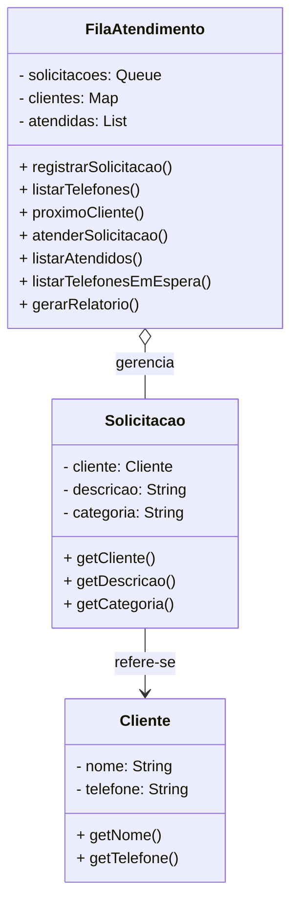

[](https://classroom.github.com/a/DaO0-MBc)

# Sistema de Fila de Atendimento

Este projeto simula um sistema de atendimento para uma empresa, organizando clientes conforme a ordem de chegada das solicitações.

## Funcionalidades

- Registrar solicitações vinculadas a um cliente.
- Listar todos os telefones de clientes registrados.
- Ver o próximo cliente da fila.
- Atender clientes (remover da fila).
- Listar nomes dos clientes atendidos.
- Listar telefones dos clientes ainda em espera.
- Gerar um relatório estatístico completo.

## Esturturas de dados usadas

- Estruturas utilizadas: `Queue`, `HashMap`, `ArrayList`, `LinkedList`, `Scanner`

## ▶️ Como Executar

1. coloque no bloco application de build.gradle -> mainClass = 'ifsc.poo.atendimento.Main'
2. execute a build projeto com gradle
   ```bash
   ./gradlew build
3. rode o projeto com gradle
   ```bash
   ./gradlew run

### Diagrama em Mermaid (código)


### Visualização

