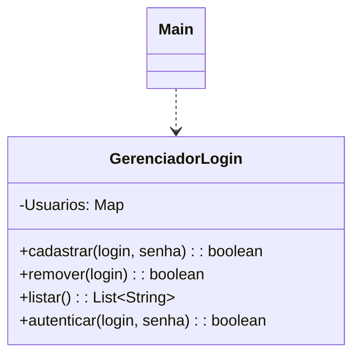
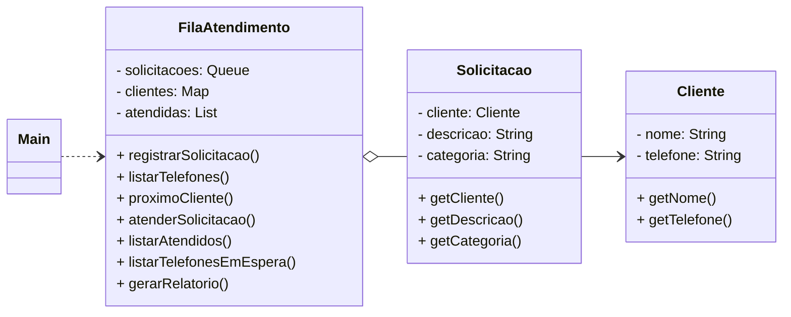
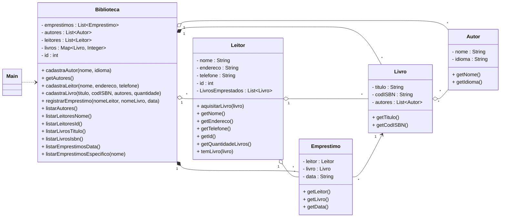

[](https://classroom.github.com/a/DaO0-MBc)

# Gerenciador de Login 
Este projeto é uma aplicação Java de linha de comando para gerenciamento simples de usuários, permitindo cadastrar,
remover, listar e autenticar logins. Tudo com o uso de estruturas

## Funcionalidades

- **Cadastrar usuário** Permite adicionar um novo usuário com login e senha (não permite logins duplicados).

- **Remover usuário** Remove um usuário existente pelo login.

- **Listar usuários** Mostra todos os logins cadastrados.

- **Autenticar usuário** Verifica se o login e senha informados estão corretos.

- **Sair** Encerra o programa.

## Esturturas de dados usadas

- Estruturas utilizadas: `Queue`, `HashMap`, `ArrayList`, `LinkedList`

## Como Executar

1. coloque no bloco application de build.gradle -> mainClass = 'ifsc.poo.atendimento.Main'
2. execute a build projeto com gradle
   ```bash
   ./gradlew build
3. rode o projeto com gradle
   ```bash
   ./gradlew run

### Diagrama em Mermaid (código)

### Visualização

---

# Fila de Atendimento

Este projeto simula um sistema de atendimento para uma empresa, organizando clientes conforme a ordem de chegada das solicitações.

## Funcionalidades

- **Registrar Solicitação**
 Registrar solicitações vinculadas a um cliente.
- **Listar Telefones**
Listar todos os telefones de clientes registrados.
- **Próximo Cliente**
 Ver o próximo cliente da fila.
- **Atender CLiente**
 Atender clientes (remover da fila).
- **Clientes Atendidos**
Listar nomes dos clientes atendidos.
- **Telefones em espera**
Listar telefones dos clientes ainda em espera.
- **Relatório**
Gerar um relatório estatístico completo.
- **Sair**
 Encerra o programa.

## Esturturas de dados usadas

- Estruturas utilizadas: `Queue`, `HashMap`, `ArrayList`, `LinkedList`, `Scanner`

## Como Executar

1. coloque no bloco application de build.gradle -> mainClass = 'ifsc.poo.atendimento.Main'
2. execute a build projeto com gradle
   ```bash
   ./gradlew build
3. rode o projeto com gradle
   ```bash
   ./gradlew run

### Diagrama em Mermaid (código)


### Visualização


---

# Biblioteca

Este projeto é uma aplicação de linha de comando para gerenciamento de uma 
biblioteca, desenvolvida em Java. Permite cadastrar autores, leitores
(com ID único), livros (com múltiplos autores e cópias), e registrar empréstimos.
Também possibilita listar livro, autores e leitores por determinados critérios.

## Funcionalidades

- **Cadastrar Autor**  
  Armazena nome e idioma nativo do autor.
- **Cadastrar Leitor**  
  Armazena nome, endereço, telefone e gera um ID único automaticamente.
- **Cadastrar Livro**  
  Cada livro tem título, código ISBN, pode ter múltiplos autores e várias cópias disponíveis.
- **Registrar Empréstimo**  
  Associa um leitor e um livro a uma data de empréstimo, respeitando regras de disponibilidade de livros e limite de livros por leitor.
- **Listagens e Consultas**
    - Autores (ordenado por nome)
    - Leitores (por nome ou ID)
    - Livros (por título ou ISBN)
    - Empréstimos (por data ou por leitor)

## Como executar

1. Coloque todos os arquivos `.java` no diretório `ifsc/poo/biblioteca`.
2. execute a build projeto com gradle
   ```bash
   ./gradlew build
3. rode o projeto com gradle
   ```bash
   ./gradlew run

## Exemplo de uso

```
Escolha uma opção: 
1. Cadastrar Autor 
2. Cadastrar Leitor 
3. Cadastrar Livro 
4. Registrar Empréstimo 
...
```


### Visualização

